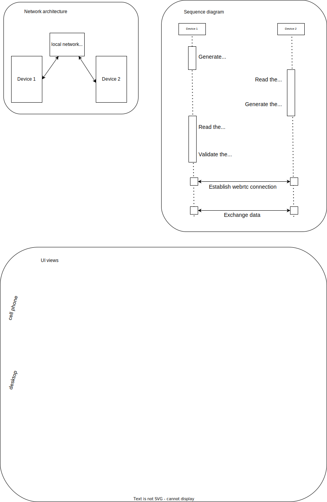

# Webrtc connection of two devices on the same local network using QR codes

The goal of this kata is to exchange data between 2 devices that can connect to the same local network.

## Requirements

  - There is one or two user involved.
  - Two devices can connect to the same local network.
  - The two devices have a webcam.
  - The local network can be disconnected from the internet.
  - There is no signaling server involved.

## Specifications

  - Make use of the webrtc protocol.
  - Initial offer and answer are exchanged using QRcode
    encoding and decoding.
  - A short security code is communicated orally.

## Things that may vary

  - What type and format of data is exchanged?
  - How the data is stored on the clients?
  - Can user do live data edition? Both of them?
  - Exchange public keys.
    - Sign a documents to proof its authenticity.
    - Encrypt a document to protect its privacy during the tansfer.

## Diagrams

